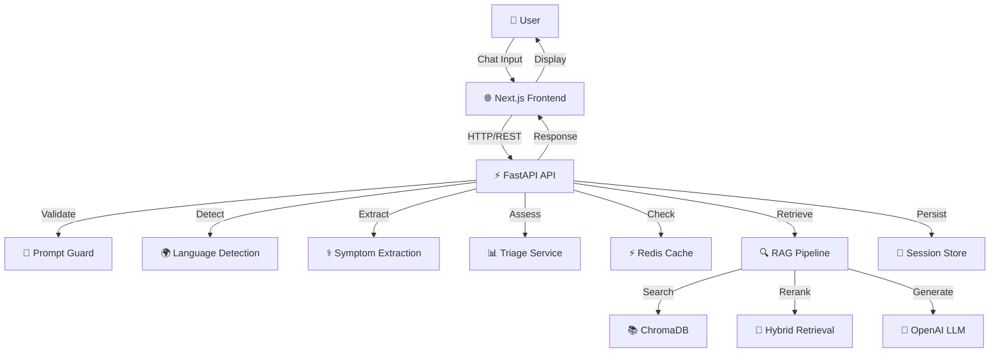

# 🏥 AI Healthcare Platform

<div align="center">

> **Enterprise-Grade AI Healthcare Assistant with Retrieval-Augmented Generation**

**Founded by**: _Arvind Sisodiya_

[](https://fastapi.tiangolo.com/)
[](https://nextjs.org/)
[](https://python.org/)
[](https://www.typescriptlang.org/)
[](https://docker.com/)
[](LICENSE)

[📖 Documentation](#documentation) • [🚀 Quick Start](#quick-start) • [🏗️ Architecture](#architecture) • [✨ Features](#features) • [🛣️ Roadmap](#roadmap)

</div>

---

## 🎯 Overview

**AI Healthcare Platform** is a production-ready, enterprise-grade healthcare AI system that combines:

- 🤖 **Intelligent RAG** – Retrieval-Augmented Generation with semantic search, hybrid reranking, and clinical citations
- ⚕️ **Medical Intelligence** – Symptom extraction, triage risk scoring, specialist recommendations
- 🔒 **Enterprise Security** – Prompt injection guards, rate limiting, input validation
- 📊 **Observability** – Structured logging, request tracing, latency tracking
- 🌍 **Multilingual** – Automatic language detection for English, Hindi, Spanish, French

**Medical Disclaimer**: This system provides educational information only and is **not** a substitute for professional medical advice, diagnosis, or treatment.

---

## 🚀 Quick Start

### Development Setup (3 minutes)

```bash
# Clone and install
git clone https://github.com/arvindsis11/Ai-Healthcare-Chatbot.git
cd Ai-Healthcare-Chatbot

# Configure environment
cp .env.example .env
# Edit .env — set OPENAI_API_KEY for OpenAI, or configure a local LLM
# (LM Studio / Ollama) — see docs/SETUP.md for details

# Start backend
./setup.sh
./run_backend.sh        # Terminal 1: http://localhost:8000

# Start frontend (new terminal)
./run_frontend.sh       # Terminal 2: http://localhost:3000
```

### Full Stack with Docker (1 command)

```bash
docker compose up --build
```

All services available at:
- 🌐 **Frontend**: http://localhost:3000
- 🔌 **API**: http://localhost:8000
- 📚 **API Docs**: http://localhost:8000/docs
- 📊 **Admin Dashboard**: http://localhost:3000/admin

---

## ✨ Features

### 💬 Intelligent Chat
- **Symptom Analysis** – Automatic symptom extraction with keyword + ML-assisted detection
- **Risk Triage** – Real-time risk scoring (low 🟢 | medium 🟡 | high 🔴)
- **Source Citations** – Every response includes clinical sources and evidence excerpts
- **Conversation History** – Anonymous session persistence and easy restoration

### 🔐 Security & Safety
- **Prompt Injection Guard** – Blocks jailbreak and unsafe input patterns
- **Rate Limiting** – Per-IP request throttling (configurable)
- **Input Validation** – Pydantic-powered request validation
- **Medical Disclaimers** – Automatic safety notices on all responses

### ⚡ Performance & Scalability
- **Smart Caching** – Redis + in-memory TTL cache for frequent queries  
- **Hybrid Retrieval** – Vector similarity + lexical reranking for best results
- **Document Chunking** – 120-word windows with 50% overlap for precise context
- **Session Abstraction** – Ready for PostgreSQL with current in-memory fallback

### 🛠️ Enterprise Features
- **Structured Logging** – JSON logs with request IDs and latency tracking
- **Admin Dashboard** – Analytics, symptom trends, user activity
- **Multilingual Support** – Language detection with translation scaffolding
- **API-First Design** – Clean REST endpoints for health, chat, analysis, sessions
- **Docker Ready** – Full containerization with nginx reverse proxy

---

## 🏗️ Architecture



**Layered Architecture**:
- **API Layer** – Routing, validation, orchestration
- **Service Layer** – Chat, RAG, medical intelligence, caching
- **Repository Layer** – Vector DB, session persistence
- **AI Layer** – Prompt guards, translation, medical analysis
- **Middleware** – Request IDs, latency tracking, security headers

---

## 📊 Key Capabilities

| Feature | Details |
|---------|---------|
| **RAG Pipeline** | Semantic search + lexical reranking + chunk-based citations |
| **Triage System** | Rule-based risk detection (low/medium/high with severity scores) |
| **Specialist Routing** | Automatic doctor type recommendations based on symptoms |
| **Session Management** | Anonymous chat history with optional PostgreSQL backing |
| **Caching** | Redis-first architecture with intelligent fallback |
| **Logging** | Structured JSON logs with request IDs and latency metrics |
| **Rate Limiting** | Per-IP throttling with configurable request windows |
| **Multilingual** | Language detection + translation scaffolding |

---

## 🛣️ Roadmap

### ✅ Phase 1 – AI Healthcare Assistant _(Current)_
- [x] Safe conversational healthcare guidance
- [x] RAG with clinical citations
- [x] Triage risk assessment
- [x] Enterprise infrastructure

### 📋 Phase 2 – AI Healthcare API Platform
- [ ] Multi-tenant API management
- [ ] OAuth2/JWT authentication
- [ ] Usage analytics & billing

### 🏥 Phase 3 – AI Telemedicine Platform
- [ ] Doctor network integration
- [ ] Appointment scheduling
- [ ] Longitudinal patient context

### 🔬 Phase 4 – AI Clinical Decision Support
- [ ] Knowledge graph retrieval
- [ ] Evidence-based care pathways
- [ ] Clinician audit trails

---

## 📖 Documentation

| Document | Purpose |
|----------|---------|
| [**PROJECT_STATE.md**](docs/PROJECT_STATE.md) | Readiness assessment, tech debt, component overview |
| [**ARCHITECTURE.md**](docs/ARCHITECTURE.md) | Layered design, request flow, observability |
| [**SETUP.md**](docs/SETUP.md) | Development & Docker deployment guides |
| [**API.md**](docs/API.md) | REST endpoints with request/response examples |
| [**RAG_PIPELINE.md**](docs/RAG_PIPELINE.md) | Retrieval strategy, safety measures |
| [**SECURITY.md**](docs/SECURITY.md) | Security controls & recommendations |
| [**DEPLOYMENT.md**](docs/DEPLOYMENT.md) | Production deployment & CI/CD |
| [**PRODUCT_ROADMAP.md**](docs/PRODUCT_ROADMAP.md) | 4-phase product evolution |
| [**KNOWLEDGE_GRAPH.md**](docs/KNOWLEDGE_GRAPH.md) | Future knowledge graph design |
| [**ENTERPRISE_UPGRADE_SUMMARY.md**](docs/ENTERPRISE_UPGRADE_SUMMARY.md) | Complete upgrade details |
| [**EXECUTION_CHECKLIST.md**](docs/EXECUTION_CHECKLIST.md) | All 18 implementation steps |

---

## 🧪 Testing & Validation

```bash
# Frontend
cd frontend
npm run lint      # ESLint checks
npm run build     # Production build
npm run test      # Jest unit tests

# Backend (requires dependencies)
pip install -r backend/requirements.txt
pytest tests/

# Full stack
docker compose up --build
```

### Test Status
- ✅ Frontend Build: Passing
- ✅ Frontend Lint: Passing  
- ✅ Frontend Tests: Passing
- ✅ Backend Compile: Passing
- ✅ Docker Compose: Valid

---

## 🌟 Key Endpoints

```
GET  /api/v1/health               # Health check with features
POST /api/v1/chat                 # Main chat endpoint
POST /api/v1/analyze-symptoms     # Focused symptom analysis
GET  /api/v1/sessions/{id}        # Chat history retrieval
```

### Example Request
```bash
curl -X POST http://localhost:8000/api/v1/chat \
  -H "Content-Type: application/json" \
  -d '{
    "message": "I have fever and headache",
    "symptoms": ["fever", "headache"]
  }'
```

### Example Response
```json
{
  "response": "Based on your symptoms...",
  "conversation_id": "abc-123",
  "symptom_analysis": {
    "symptoms": ["fever", "headache"],
    "severity_score": 5,
    "risk_level": "medium",
    "possible_conditions": ["General symptom cluster..."],
    "urgency_recommendation": "See doctor within 24-72 hours"
  },
  "recommended_specialist": "General Physician",
  "citations": [
    {
      "id": "fever.yml#chunk-1",
      "source": "fever.yml",
      "excerpt": "Fever is a common symptom..."
    }
  ],
  "sources": ["fever.yml"]
}
```

---

## 📁 Project Structure

```
📦 Ai-Healthcare-Chatbot
├── 🔧 backend/
│   ├── app/
│   │   ├── api/              # FastAPI routes
│   │   ├── services/         # Business logic
│   │   ├── repositories/     # Data access
│   │   ├── rag/              # RAG pipeline
│   │   ├── ai/               # Prompt guards, translation
│   │   ├── middleware/       # Security, tracing
│   │   ├── models/           # Pydantic schemas
│   │   └── core/             # Settings, logging, DI
│   ├── Dockerfile
│   └── requirements.txt
├── 🎨 frontend/
│   ├── src/
│   │   ├── app/              # Routes
│   │   ├── features/
│   │   │   ├── chat/         # Chat workspace
│   │   │   └── analytics/    # Admin dashboard
│   │   ├── components/       # Shared UI
│   │   ├── services/         # API clients
│   │   └── styles/           # Tailwind CSS
│   ├── Dockerfile
│   └── package.json
├── 🐳 docker-compose.yml    # Full stack orchestration
├── 📚 docs/                 # Enterprise documentation
├── ✅ tests/                # Test suites
└── 📖 README.md             # This file
```

---

## 💡 Enterprise Readiness

**Readiness Score: 72/100**

| Category | Score | Details |
|----------|-------|---------|
| Architecture | 82/100 | Modular layered design ✅ |
| Safety | 74/100 | Prompt guards, disclaimers ✅ |
| Observability | 70/100 | Structured logging & tracing ✅ |
| Scalability | 75/100 | Caching, abstraction layers ✅ |
| Testing | 58/100 | Core tests passing, expandable |
| Operations | 73/100 | Docker & CI/CD ready ✅ |

---

## 🔐 Security Features

- ✅ **Prompt Injection Protection** – Pattern-based guard against adversarial input
- ✅ **Rate Limiting** – Per-IP request throttling
- ✅ **Input Validation** – Pydantic schemas on all endpoints
- ✅ **Security Headers** – X-Frame-Options, X-Content-Type-Options, Referrer-Policy
- ✅ **CORS Configuration** – Configurable allow-list
- ✅ **Medical Disclaimers** – Automatic safety notices
- 🔜 **JWT Authentication** – Coming in Phase 2

---

## 🤝 Contributing

We welcome contributions! Please read our [Contributing Guide](docs/CONTRIBUTING.md) and
[Code of Conduct](CODE_OF_CONDUCT.md) before getting started.

To contribute:

1. Fork the repository
2. Create a feature branch (`git checkout -b feature/amazing-feature`)
3. Commit changes (`git commit -m 'Add amazing feature'`)
4. Push branch (`git push origin feature/amazing-feature`)
5. Open Pull Request

Looking for something to work on? Check the [open issues](https://github.com/arvindsis11/Ai-Healthcare-Chatbot/issues)
or the full list of proposed improvements in [GITHUB_ISSUES.md](GITHUB_ISSUES.md).

---

## 📜 License

This project is licensed under the MIT License – see [LICENSE](LICENSE) file for details.

---

## 👨‍💼 About Author

**Arvind Sisodiya** – Healthcare AI Architect & Full-Stack Engineer

Passionate about building enterprise-grade AI systems that make healthcare accessible and safe.

---

<div align="center">

### 🚀 Ready to Get Started?

```bash
docker compose up --build
```

**Questions?** Check the [📖 documentation](docs/) or open an issue!

**Built with ❤️ for healthcare professionals and patients worldwide**

</div>
