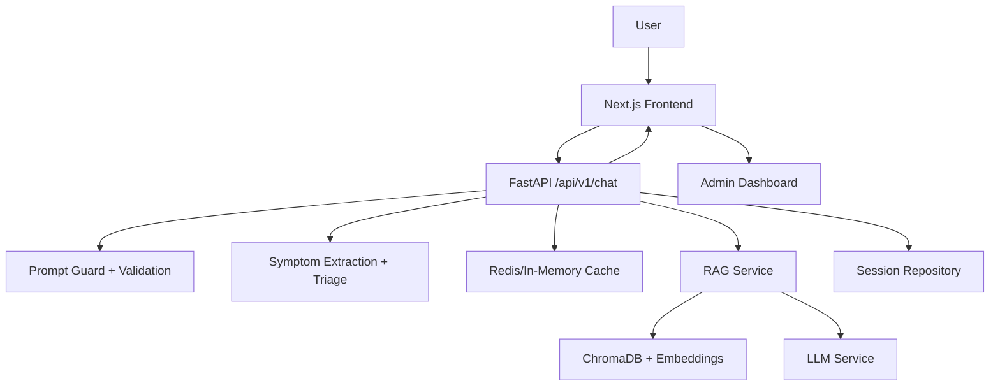

# Project State - Enterprise Upgrade Baseline

## Runtime Architecture

The platform runs as a layered healthcare AI stack:

1. Next.js frontend (`frontend/src`) serves chat UI, citations, history sidebar, and admin dashboard.
2. FastAPI API (`backend/app/api`) exposes chat, symptom analysis, health, and session history endpoints.
3. Service layer (`backend/app/services`) orchestrates RAG, medical intelligence, cache, and LLM generation.
4. Repository layer (`backend/app/repositories`) handles vector retrieval and chat session persistence abstraction.
5. AI layer (`backend/app/ai`) handles prompt safety checks and multilingual detection/translation hooks.
6. Middleware (`backend/app/middleware`) provides request IDs, latency tracking, body size limits, and rate limiting.

## Component Interaction Diagram

## Dependency Analysis

### Backend critical dependencies
- FastAPI/uvicorn: API runtime.
- LangChain + OpenAI: response orchestration.
- ChromaDB + SentenceTransformers: retrieval stack.
- redis: distributed cache adapter.
- psycopg: PostgreSQL connectivity scaffold.
- spacy: symptom extraction assist with fallback.

### Frontend critical dependencies
- Next.js + React + TypeScript: app shell.
- Tailwind CSS: styling system.
- Radix UI Accordion: accessible structured symptom panel.
- Framer Motion: response-area animation.

### Infrastructure dependencies
- Docker + Compose: local full-stack runtime.
- NGINX: reverse proxy.
- GitHub Actions: backend/frontend/docker CI pipelines.

## Enterprise Readiness Score

Current score: **72/100**

- Architecture modularity: 82
- Safety guardrails: 74
- Observability baseline: 70
- Scalability infrastructure: 75
- Test automation depth: 58
- Operational maturity: 73

## Technical Debt List

1. PostgreSQL repository is currently scaffolded by schema and abstraction; production DB adapter and migrations should be completed.
2. Translation service is currently a placeholder and should be wired to managed translation APIs.
3. Redis cache strategy can be improved with cache invalidation policies and metrics.
4. Frontend unit/integration test coverage is still below 80%.
5. RAG reranking is currently lexical+vector heuristic; can be upgraded to cross-encoder reranking.
6. Admin analytics uses placeholder metrics and needs real telemetry ingestion.
7. Knowledge graph is designed but not yet integrated into inference-time retrieval.
